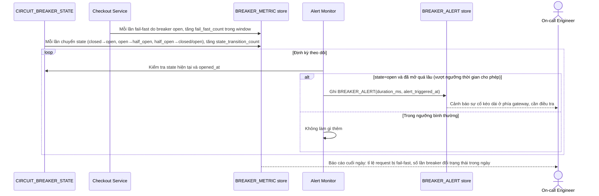

# Enhance sequence — Breaker metrics & alerting

Đây là **enhance**, flow hoàn toàn mới, phát sinh từ enhance — chưa tồn tại ở base. Đáp ứng yêu cầu thứ 5 của đề bài: đo tỉ lệ fail-fast, số lần breaker chuyển trạng thái trong ngày, và alert khi breaker mở quá lâu.

