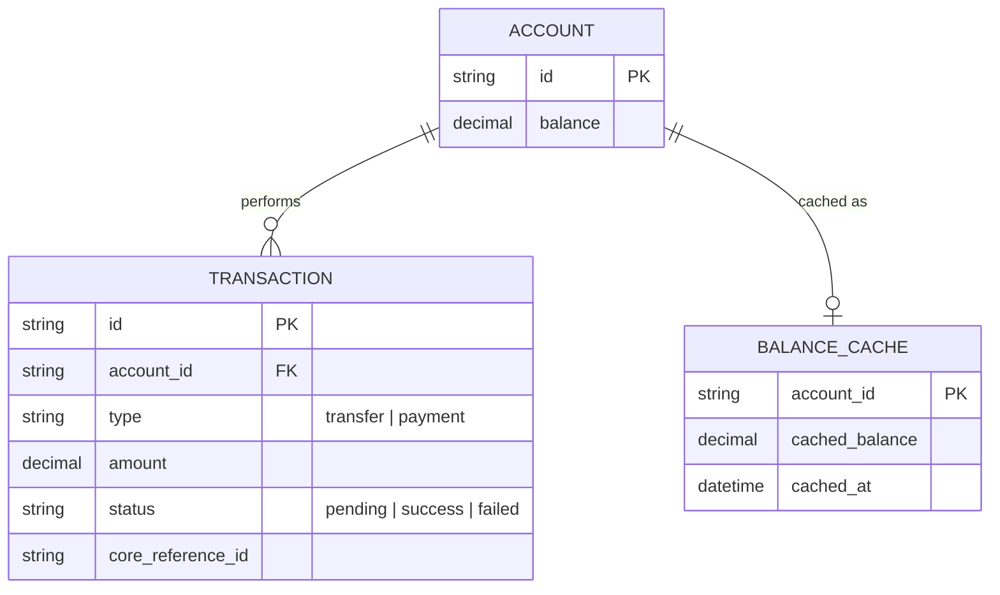

# Base ERD — App ngân hàng số trước khi bảo vệ core banking

Đây là **base**: mô hình dữ liệu suy luận từ ngữ cảnh đề bài, thể hiện trạng thái hệ thống **trước khi** có circuit breaker chặt và retry an toàn cho core banking. Đề bài nói app gọi trực tiếp core banking để lấy số dư và thực hiện giao dịch — nên base cần đủ: tài khoản, giao dịch, và cache số dư đơn giản. Chưa có entity nào phục vụ breaker riêng cho core banking/audit log retry/escalation — những thứ đó là phần enhance.

