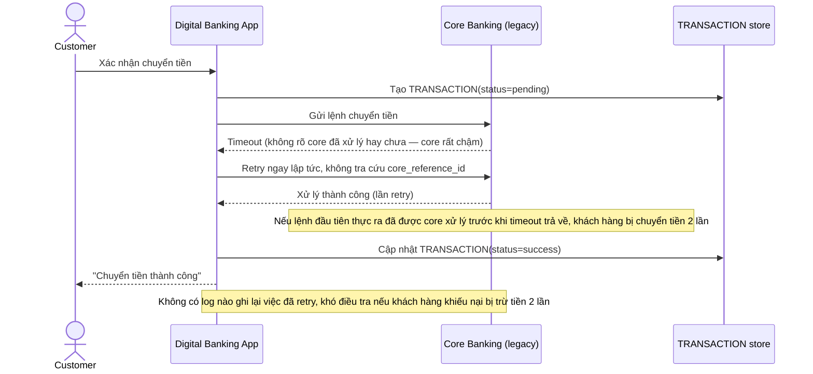

# Base sequence — Transfer money (retry mù, không tra cứu trạng thái)

Đây là **base**, flow "Chuyển tiền" ở trạng thái hiện tại — timeout là retry ngay, không tra cứu xem core banking đã xử lý request trước đó chưa. Flow này liên quan mật thiết tới enhance vì yêu cầu thứ 2 và 5 của đề bài chính là sửa đúng lỗ hổng nguy hiểm này.

