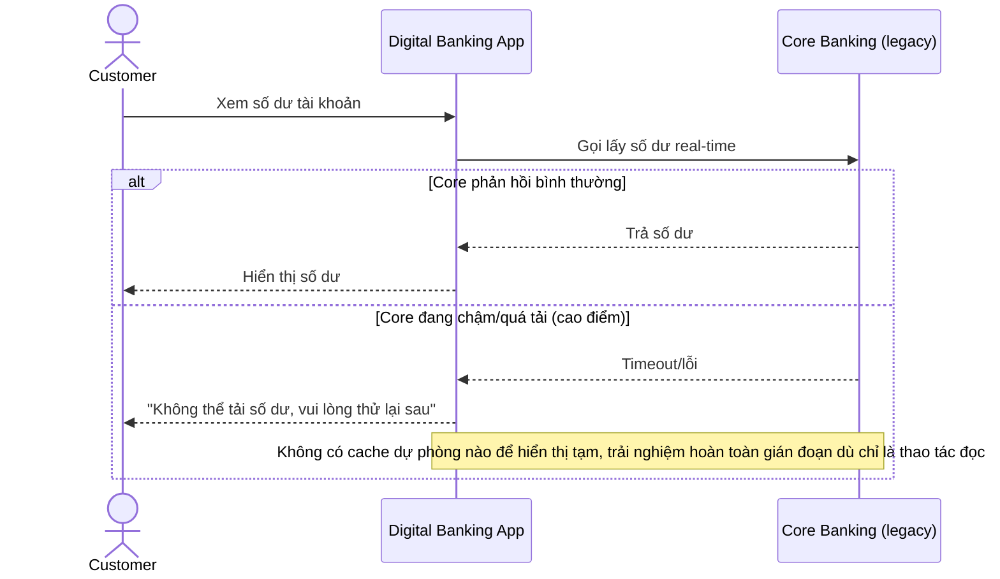

# Base sequence — View balance (không có fallback khi core chậm)

Đây là **base**, flow "Xem số dư" — gọi thẳng core banking real-time, không có phương án dự phòng khi core chậm/quá tải. Flow này liên quan mật thiết tới enhance vì yêu cầu thứ 3 của đề bài chính là thêm fallback rõ ràng ở đây.

