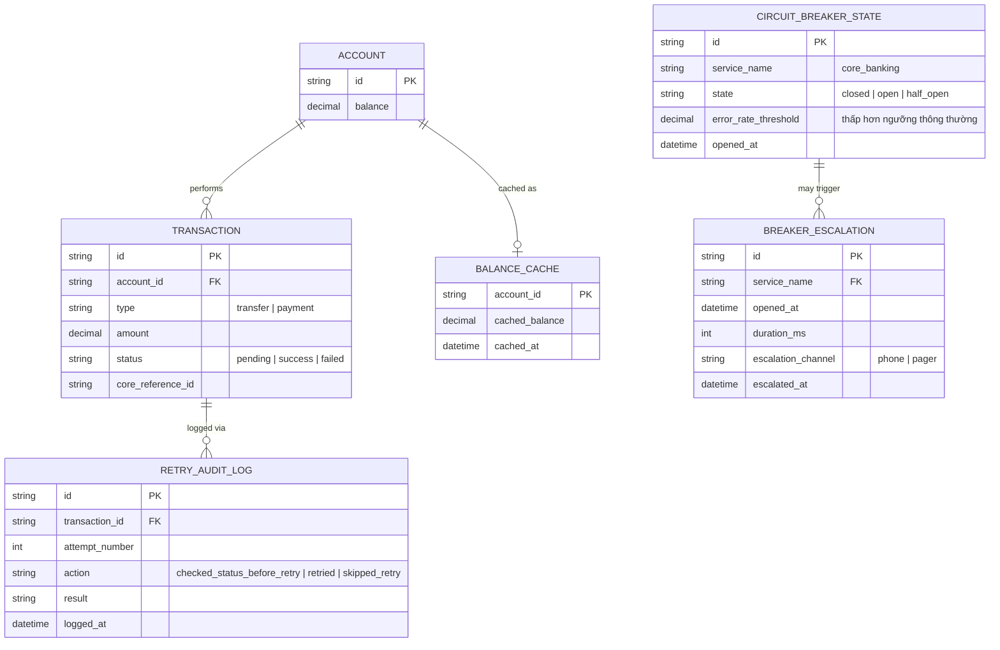

# Enhance ERD — sau khi có circuit breaker chặt bảo vệ core banking

Đây là ERD **sau khi** enhance được áp dụng lên base. So với base, có 3 nhóm entity mới, ứng trực tiếp với 5 yêu cầu trong đề bài:

- `CIRCUIT_BREAKER_STATE` (mới) — ngưỡng mở thấp hơn bình thường, ưu tiên bảo vệ core banking.
- `RETRY_AUDIT_LOG` (mới) — ghi lại mọi lần tra cứu trạng thái/retry/bỏ qua retry cho giao dịch tiền, phục vụ audit.
- `BREAKER_ESCALATION` (mới) — escalate khẩn tới team vận hành khi breaker mở kéo dài.
- `BALANCE_CACHE` giữ nguyên nhưng nay được dùng chủ động làm fallback có gắn nhãn rõ ràng.

