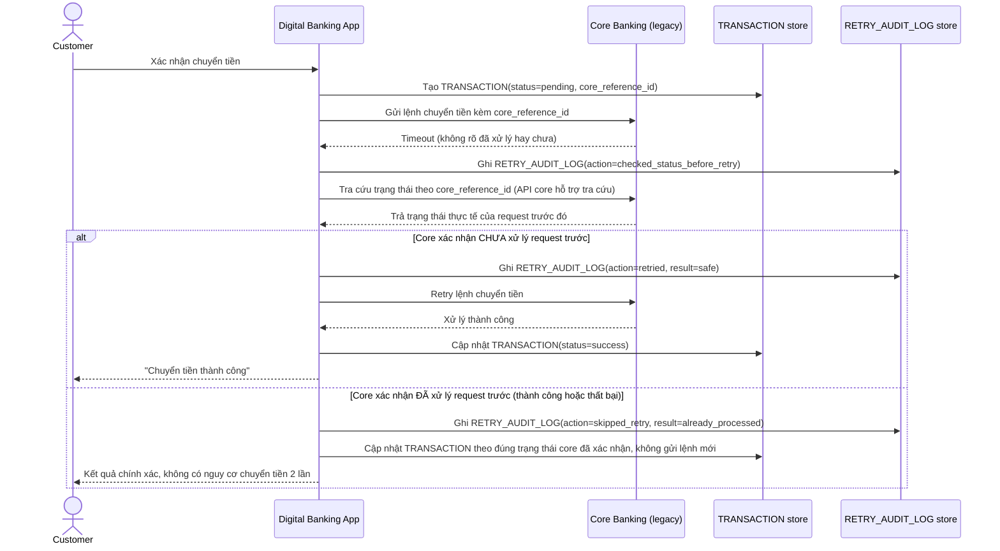

# Enhance sequence — Transfer money (tra cứu trạng thái trước khi retry)

Đây là **enhance**, cùng flow "Transfer money" đã có ở base nhưng nay thay đổi hoàn toàn theo yêu cầu 2 và 5 của đề bài: chỉ retry khi chắc chắn core banking chưa xử lý, dựa vào tra cứu core_reference_id, và ghi log đầy đủ mọi quyết định.

