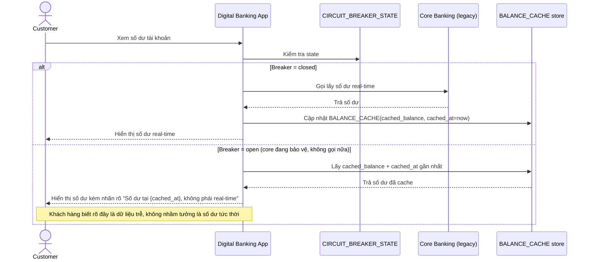

# Enhance sequence — View balance (fallback cache gắn nhãn rõ ràng)

Đây là **enhance**, cùng flow "View balance" đã có ở base nhưng nay thay đổi theo yêu cầu thứ 3 của đề bài: khi breaker mở, fallback về số dư cache gần nhất, nhưng hiển thị rõ đây không phải real-time.

