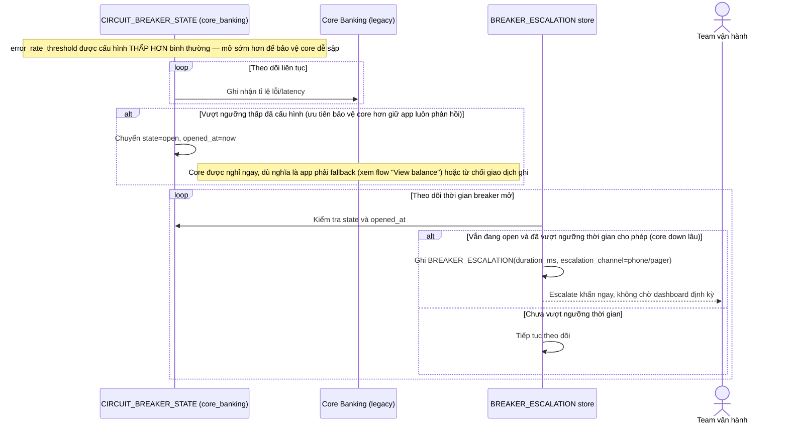

# Enhance sequence — Breaker tight threshold & escalation

Đây là **enhance**, flow hoàn toàn mới, phát sinh từ enhance — chưa tồn tại ở base (base không có breaker riêng cho core banking). Đáp ứng yêu cầu 1 và 4 của đề bài: ngưỡng mở thấp hơn bình thường để ưu tiên bảo vệ core banking, và escalate khẩn ngay khi breaker mở kéo dài.

