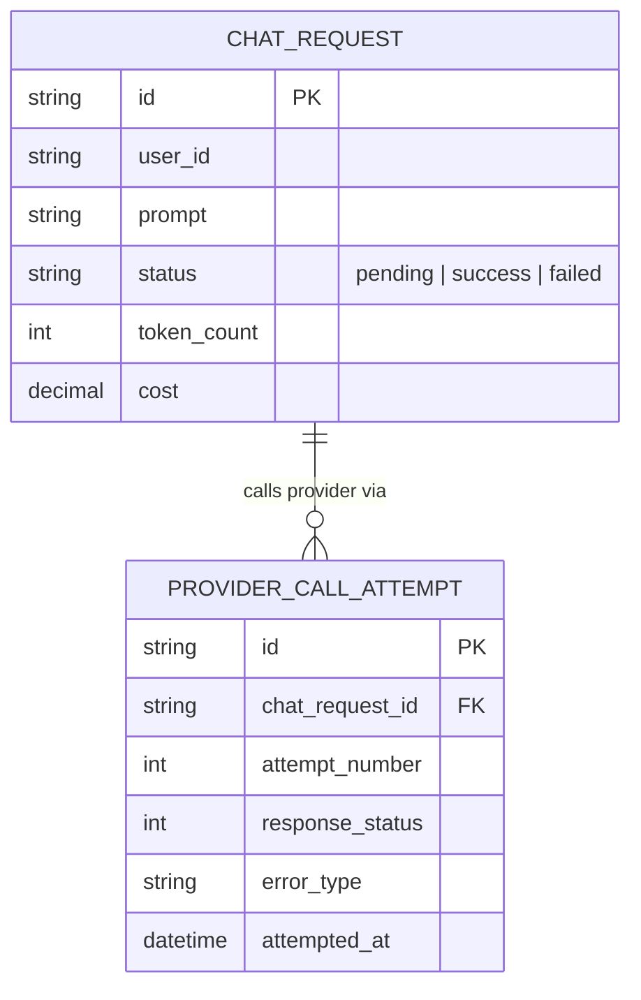

# Base ERD — Chat AI trước khi có circuit breaker + retry phân loại lỗi

Đây là **base**: mô hình dữ liệu suy luận từ ngữ cảnh đề bài, thể hiện trạng thái hệ thống **trước khi** có retry/circuit breaker thông minh. Đề bài nói SaaS gọi 1 provider AI bên ngoài, tính phí theo token — nên base cần đủ: request chat và các lần gọi provider, chưa phân loại lỗi. Chưa có entity nào phục vụ retry policy/breaker/fallback provider/đo chi phí retry — những thứ đó là phần enhance.

