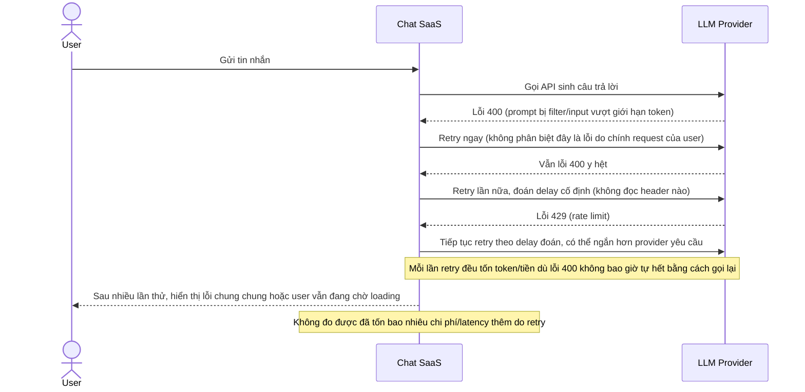

# Base sequence — Send chat message (retry mù, không phân biệt lỗi)

Đây là **base**, flow "Gửi tin nhắn chat AI" ở trạng thái hiện tại — retry mọi loại lỗi như nhau, đoán thời gian chờ, không giới hạn rõ số lần. Flow này liên quan mật thiết tới enhance vì toàn bộ 5 yêu cầu của đề bài đều nhằm sửa đúng các lỗ hổng ở đây.

