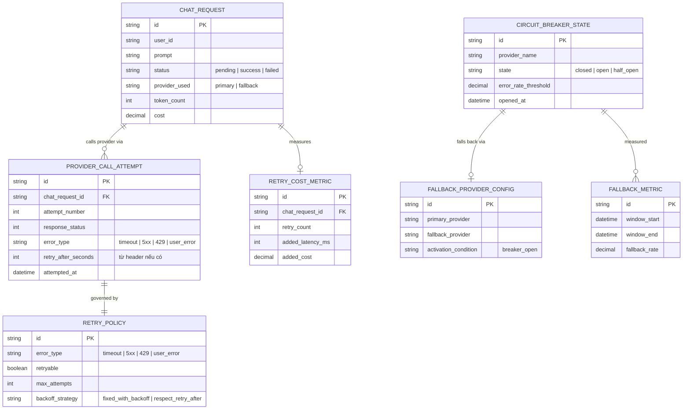

# Enhance ERD — sau khi có retry phân loại lỗi + circuit breaker + fallback

Đây là ERD **sau khi** enhance được áp dụng lên base. So với base, có 4 nhóm entity mới, ứng trực tiếp với 5 yêu cầu trong đề bài:

- `RETRY_POLICY` (mới) — phân loại rõ lỗi nào được retry (timeout/5xx/429), lỗi nào không (user_error), giới hạn số lần và cách tính backoff (tôn trọng `retry-after` cho 429).
- `CIRCUIT_BREAKER_STATE` + `FALLBACK_PROVIDER_CONFIG` (mới) — mở breaker khi tỉ lệ lỗi vượt ngưỡng, chuyển sang provider dự phòng hoặc trả lỗi thân thiện.
- `RETRY_COST_METRIC` + `FALLBACK_METRIC` (mới) — đo latency/chi phí phát sinh do retry và tỉ lệ phải fallback.

