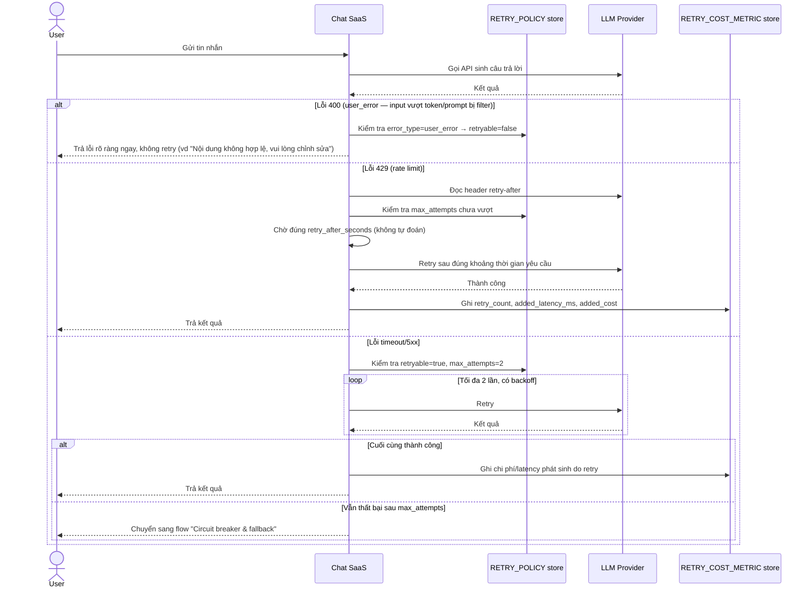

# Enhance sequence — Send chat message (retry phân loại lỗi, tôn trọng retry-after)

Đây là **enhance**, cùng flow "Send chat message" đã có ở base nhưng nay thay đổi hoàn toàn theo yêu cầu 1, 2, 4 và 5 của đề bài: chỉ retry timeout/5xx với giới hạn số lần, tôn trọng header `retry-after` cho 429, tuyệt đối không retry lỗi do request của user, và đo chi phí/latency phát sinh do retry.

