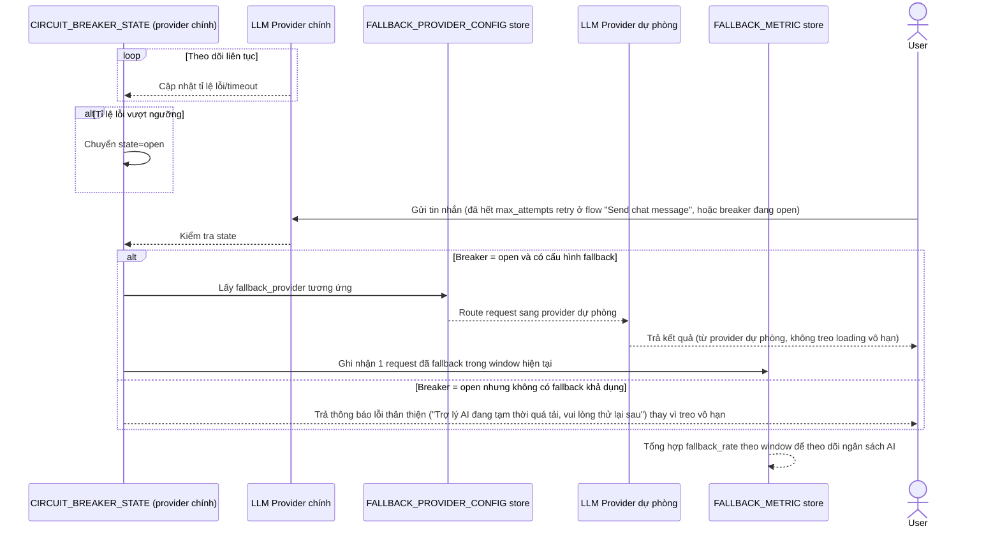

# Enhance sequence — Circuit breaker & fallback provider

Đây là **enhance**, flow hoàn toàn mới, phát sinh từ enhance — chưa tồn tại ở base (base không có breaker/fallback, chỉ retry vô hạn). Đáp ứng yêu cầu thứ 3 và phần còn lại của yêu cầu thứ 5 của đề bài: breaker mở khi tỉ lệ lỗi vượt ngưỡng, fallback rõ ràng sang provider dự phòng hoặc lỗi thân thiện, và đo tỉ lệ fallback.

