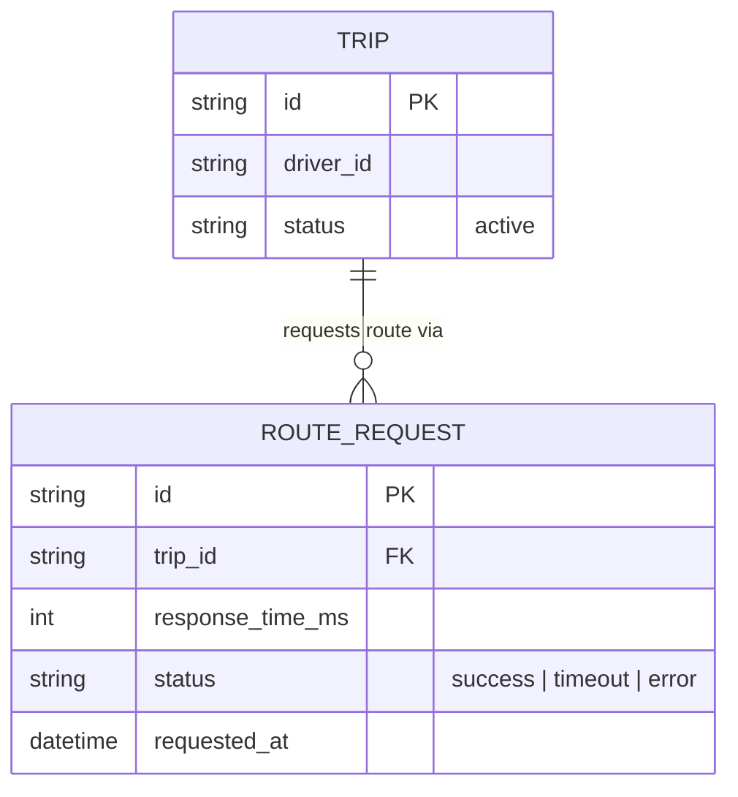

# Base ERD — App tài xế trước khi có circuit breaker nhạy latency

Đây là **base**: mô hình dữ liệu suy luận từ ngữ cảnh đề bài, thể hiện trạng thái hệ thống **trước khi** có breaker nhạy latency + fallback route. Đề bài nói chuyến đi đang chạy real-time gọi API bản đồ để tính route/ETA — nên base cần đủ: chuyến đi và các lần gọi route, không lưu gì để dùng làm fallback. Chưa có entity nào phục vụ cached route fallback/breaker nhạy latency/provider dự phòng/metric theo vùng — những thứ đó là phần enhance.

