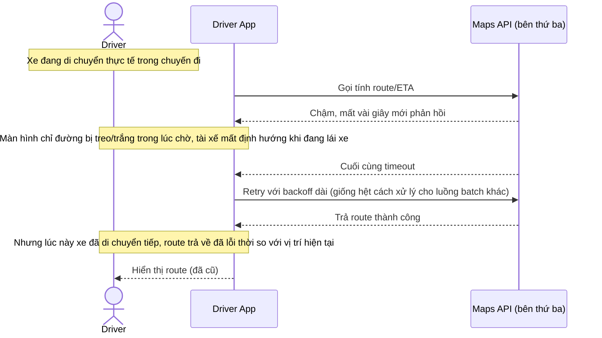

# Base sequence — Get route during trip (treo màn hình, retry kiểu batch)

Đây là **base**, flow "Lấy route/ETA trong lúc chuyến đi đang chạy" ở trạng thái hiện tại — coi như mọi API khác, retry với backoff dài, không có fallback nào trong lúc chờ. Flow này liên quan mật thiết tới enhance vì toàn bộ 5 yêu cầu của đề bài đều nhằm sửa đúng các lỗ hổng nguy hiểm ở đây.

