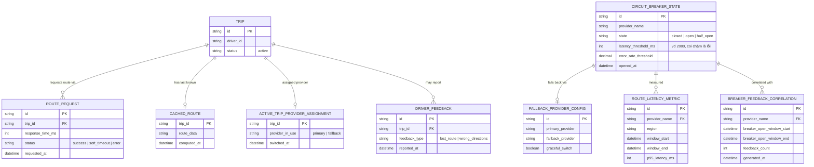

# Enhance ERD — sau khi có breaker nhạy latency + graceful switch

Đây là ERD **sau khi** enhance được áp dụng lên base. So với base, có 5 nhóm entity mới, ứng trực tiếp với 5 yêu cầu trong đề bài:

- `CACHED_ROUTE` (mới) — route gần nhất tính thành công, dùng làm fallback tức thời khi API chậm.
- `CIRCUIT_BREAKER_STATE` thêm `latency_threshold_ms` — coi timeout mềm (chậm) như 1 dạng lỗi để tính vào ngưỡng mở breaker.
- `ACTIVE_TRIP_PROVIDER_ASSIGNMENT` + `FALLBACK_PROVIDER_CONFIG` (mới) — graceful switch toàn bộ chuyến đang chạy sang provider dự phòng, không cần khởi động lại app.
- `ROUTE_LATENCY_METRIC` (mới) — đo latency theo từng khu vực địa lý.
- `DRIVER_FEEDBACK` + `BREAKER_FEEDBACK_CORRELATION` (mới) — tương quan thời gian breaker mở với phản hồi tiêu cực từ tài xế.

