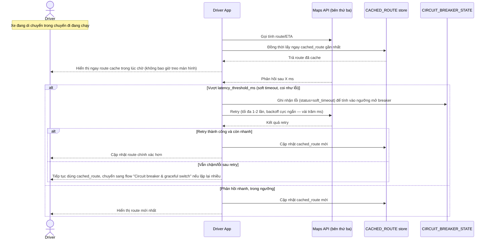

# Enhance sequence — Get route during trip (fallback cache tức thời, retry siêu chặt)

Đây là **enhance**, cùng flow "Get route during trip" đã có ở base nhưng nay thay đổi hoàn toàn theo yêu cầu 1, 2 và 3 của đề bài: coi chậm (soft timeout) là lỗi, fallback ngay về cached route trong lúc chờ, retry tối đa 1-2 lần với backoff cực ngắn.

