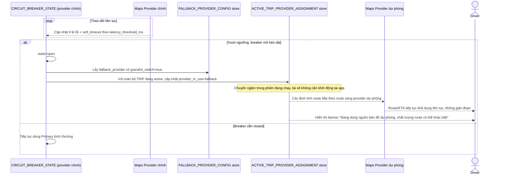

# Enhance sequence — Circuit breaker & graceful provider switch

Đây là **enhance**, flow hoàn toàn mới, phát sinh từ enhance — chưa tồn tại ở base (base không có breaker/provider dự phòng). Đáp ứng yêu cầu thứ 4 của đề bài: khi breaker mở kéo dài, tự động chuyển toàn bộ chuyến đang chạy sang provider dự phòng theo cơ chế graceful, không gián đoạn phiên, kèm thông báo rõ cho tài xế.

