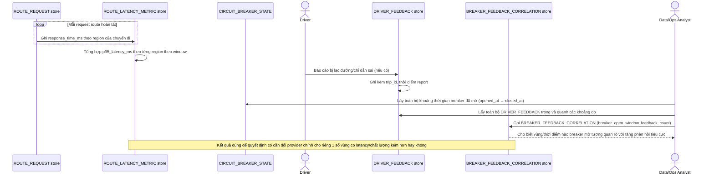

# Enhance sequence — Route latency theo vùng & tương quan phản hồi tài xế

Đây là **enhance**, flow hoàn toàn mới, phát sinh từ enhance — chưa tồn tại ở base. Đáp ứng yêu cầu thứ 5 của đề bài: đo latency theo từng khu vực địa lý, tỉ lệ fallback, và tương quan thời gian breaker mở với phản hồi tiêu cực từ tài xế.

