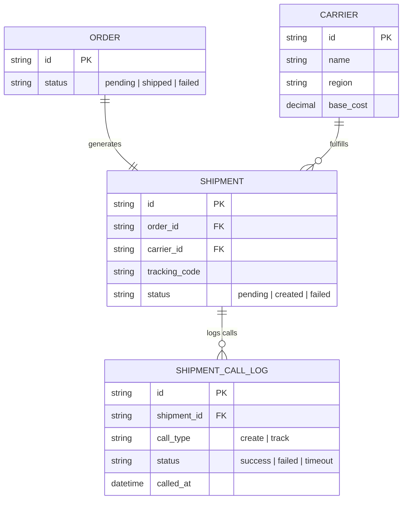

# Base ERD — Hệ thống tạo vận đơn qua API carrier trước khi có circuit breaker

Đây là **base**: mô hình dữ liệu suy luận từ ngữ cảnh đề bài, thể hiện trạng thái hệ thống **trước khi** có circuit breaker riêng biệt theo carrier. Đề bài giả định hệ thống logistics đã gọi API của nhiều đối tác vận chuyển để tạo vận đơn và tra cứu trạng thái, nên base cần đủ: danh sách carrier, đơn hàng, vận đơn, và log các lần gọi API (không phân loại lỗi, không breaker, không fallback, không đo lường riêng theo carrier — những thứ đó là phần enhance).

