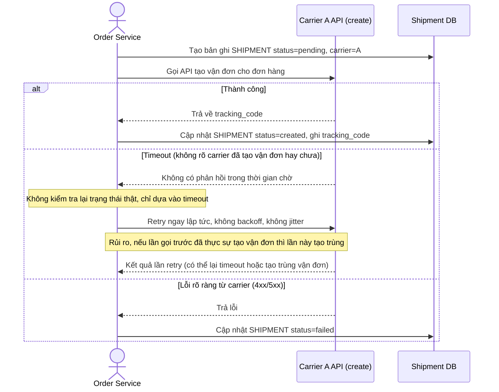

# Base sequence — Create shipment (chưa có circuit breaker, retry mù)

Đây là **base**, flow "tạo vận đơn" ở trạng thái trước enhance. Hệ thống chỉ gọi thẳng carrier được gán cho đơn hàng, không có breaker, không có carrier dự phòng, và khi timeout thì retry mù ngay lập tức mà không xác minh trạng thái thật ở phía carrier. Flow này là nền để so sánh với flow cùng tên ở enhance (per-carrier breaker, xác minh trước khi retry, fallback, jitter).

