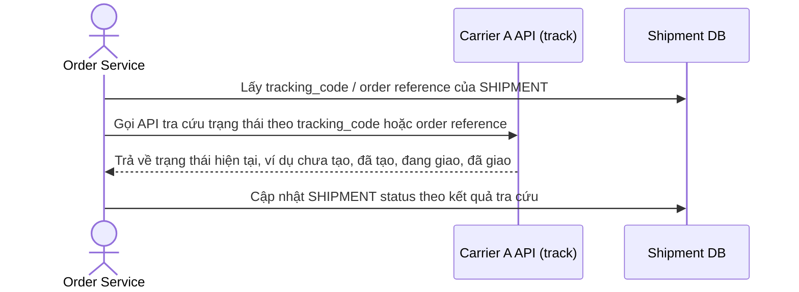

# Base sequence — Track shipment status

Đây là **base**, flow tra cứu trạng thái vận đơn qua API của chính carrier đã tạo đơn đó. Flow này vốn đã tồn tại độc lập (dùng để cập nhật trạng thái giao hàng cho khách/nội bộ) và ở base chưa được dùng cho mục đích nào khác. Flow này quan trọng vì ở enhance, chính API tra cứu này sẽ được tái sử dụng để xác minh trước khi quyết định retry (yêu cầu 3), thay vì retry mù như flow tạo vận đơn ở base.

