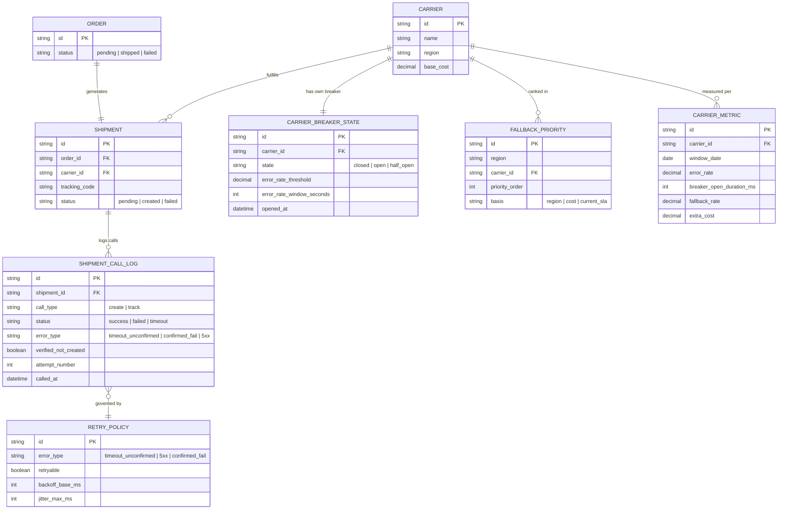

# Enhance ERD — Circuit breaker độc lập theo carrier + fallback an toàn

Đây là ERD **sau khi** enhance được áp dụng lên base. So với base, có 4 nhóm entity mới, ứng trực tiếp với các yêu cầu trong đề bài:

- `CARRIER_BREAKER_STATE` (mới) — 1 breaker riêng cho mỗi carrier, ngưỡng lỗi/thời gian mở cấu hình độc lập theo từng carrier, không dùng chung 1 breaker toàn cục (yêu cầu 1).
- `FALLBACK_PRIORITY` (mới) — thứ tự ưu tiên carrier dự phòng theo vùng phục vụ, chi phí, hoặc SLA hiện tại, dùng khi breaker carrier chính mở (yêu cầu 2).
- `RETRY_POLICY` (mới) — phân loại lỗi nào được retry, có backoff_base_ms và jitter_max_ms để tránh dồn request vào carrier lúc cao điểm (yêu cầu 3, 4).
- `SHIPMENT_CALL_LOG` (sửa) — thêm `error_type` và `verified_not_created` để ghi rõ đã xác minh qua API tra cứu trước khi retry hay chưa (yêu cầu 3).
- `CARRIER_METRIC` (mới) — đo tỉ lệ lỗi, thời gian breaker mở trong ngày, tỉ lệ đơn phải fallback, và chi phí phát sinh do fallback, theo từng carrier (yêu cầu 5).

