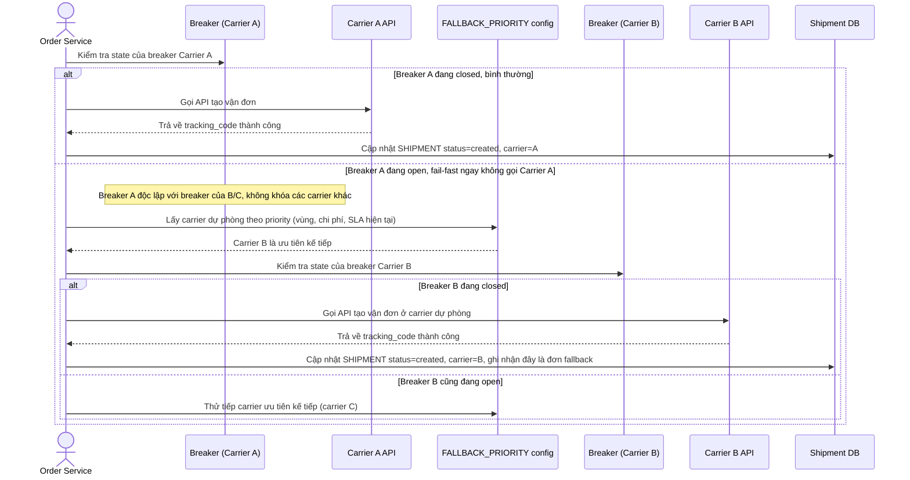

# Enhance sequence — Create shipment (breaker độc lập theo carrier + fallback)

Đây là **enhance**, cùng flow "create-shipment" như ở base nhưng thay đổi ở chỗ: mỗi carrier có breaker riêng nên breaker của carrier A mở không ảnh hưởng tới carrier B (yêu cầu 1), và khi breaker A mở hệ thống fail-fast rồi tự động chuyển sang carrier dự phòng theo thứ tự ưu tiên cấu hình sẵn (yêu cầu 2). So với base, request không còn gọi thẳng 1 carrier cố định mà luôn kiểm tra breaker riêng của carrier trước khi gọi.

