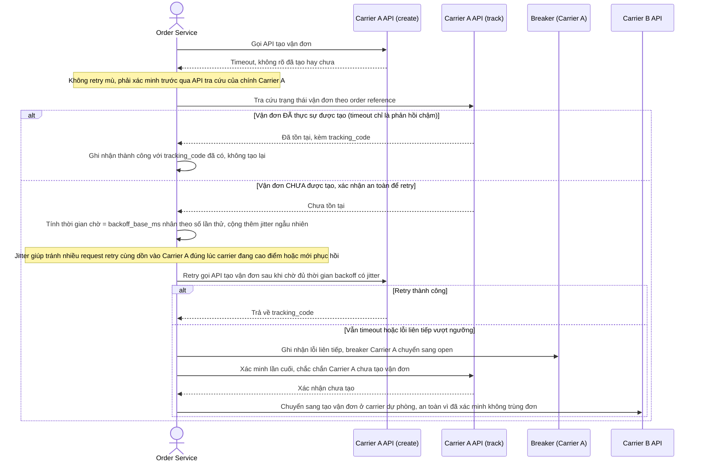

# Enhance sequence — Retry an toàn sau timeout (xác minh trước khi retry, backoff có jitter)

Đây là **enhance**, flow hoàn toàn mới, mô tả chi tiết điều gì xảy ra khi một lần gọi API tạo vận đơn bị timeout (khác với trường hợp breaker đã mở ở flow create-shipment). Đáp ứng yêu cầu 2 (tránh tạo trùng vận đơn khi thực ra carrier A đã tạo thành công), yêu cầu 3 (chỉ retry sau khi xác minh qua API tra cứu của chính carrier đó rằng vận đơn thực sự chưa được tạo), và yêu cầu 4 (backoff giữa các lần retry có jitter để tránh dồn request vào carrier lúc cao điểm).

