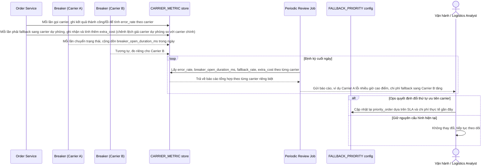

# Enhance sequence — Đo lường và đánh giá định kỳ theo từng carrier

Đây là **enhance**, flow hoàn toàn mới, đáp ứng yêu cầu 5 của đề bài: đo lường riêng theo từng carrier gồm tỉ lệ lỗi, thời gian breaker mở trong ngày, tỉ lệ đơn phải fallback sang carrier dự phòng, và chi phí phát sinh do fallback, dùng để đánh giá định kỳ có nên đổi thứ tự ưu tiên carrier hay không.

