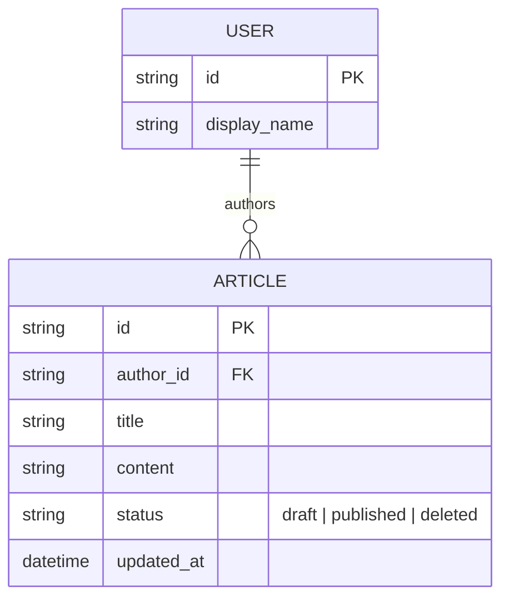

# Base ERD — Trình soạn thảo CMS trước khi có autosave draft bằng IndexedDB

Đây là **base**: mô hình dữ liệu suy luận từ ngữ cảnh đề bài, mô tả trạng thái hệ thống **trước khi** có cơ chế autosave draft cục bộ. Đề bài nói tới trình soạn thảo rich-text lưu bài lên server, nên base chỉ cần User và Article ở phía server, lưu trực tiếp khi bấm Save hoặc autosave định kỳ thẳng lên server. Chưa có bất kỳ entity nào phía client (IndexedDB draft, đo hiệu năng gõ, trạng thái storage) — toàn bộ phần đó là enhance.

