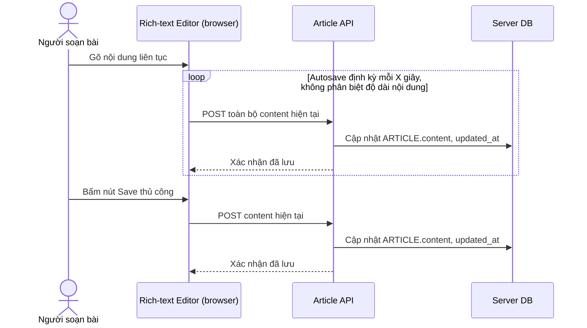

# Base sequence — Edit article (lưu thẳng lên server, chưa có autosave cục bộ)

Đây là **base**, flow soạn thảo bài viết ở trạng thái trước enhance. Người dùng gõ nội dung, việc lưu chỉ xảy ra khi bấm nút Save thủ công hoặc autosave định kỳ gọi thẳng API server, không có bước lưu tạm cục bộ nào. Flow này là nền để so sánh với flow cùng tên ở enhance, nơi autosave chuyển sang debounce ghi vào IndexedDB trước.

