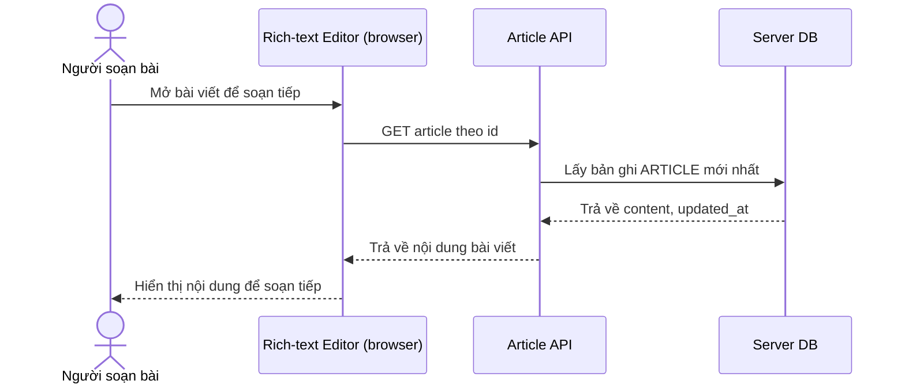

# Base sequence — Open article (chưa có kiểm tra draft cục bộ)

Đây là **base**, flow mở bài viết để soạn tiếp. Trình soạn thảo chỉ đơn giản tải bản mới nhất từ server và hiển thị, không có khái niệm draft cục bộ nên không có bước so sánh hay hỏi người dùng chọn phiên bản nào. Flow này là nền để so sánh với flow cùng tên ở enhance, nơi việc mở bài viết phải kiểm tra thêm draft trong IndexedDB.

