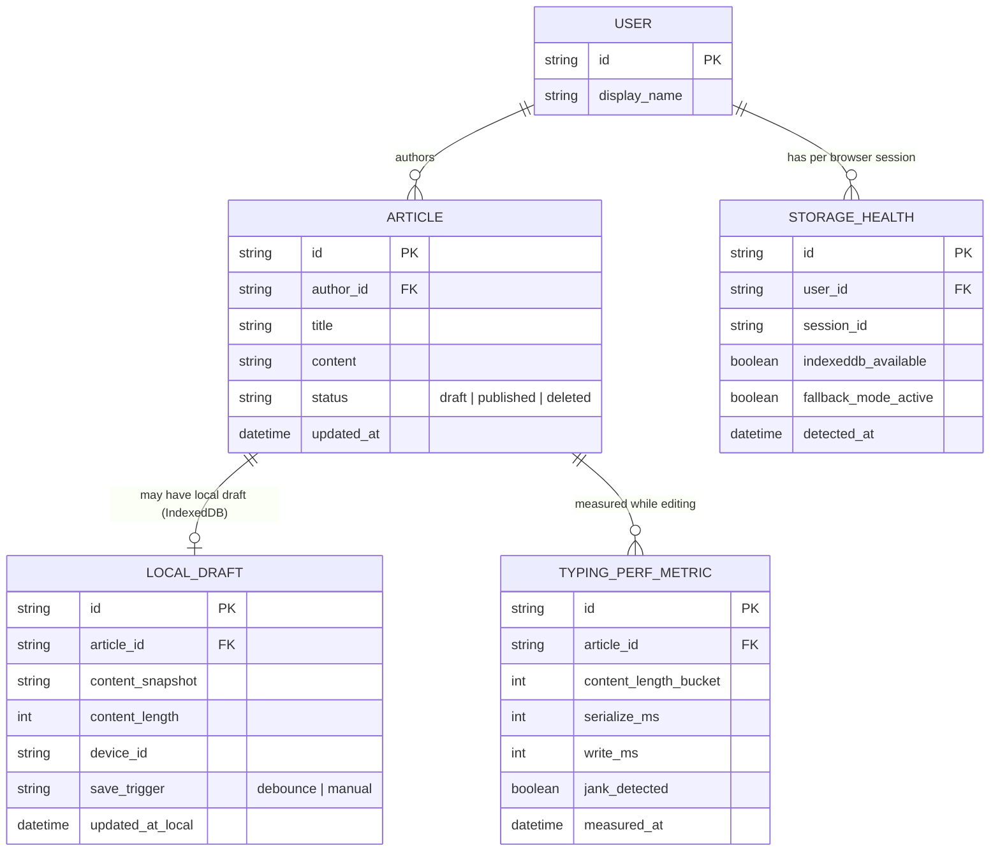

# Enhance ERD — Autosave draft cục bộ bằng IndexedDB

Đây là ERD **sau khi** enhance được áp dụng lên base. So với base (chỉ có USER/ARTICLE ở server), phần enhance thêm 3 entity mới hoàn toàn ở phía client/observability, ứng trực tiếp với các yêu cầu trong đề bài:

- `LOCAL_DRAFT` (mới, lưu trong IndexedDB) — snapshot content debounce mỗi 2-3 giây, kèm `content_length` và `updated_at_local` để so sánh với `ARTICLE.updated_at` trên server — phục vụ yêu cầu 1, 2, 3.
- `TYPING_PERF_METRIC` (mới) — đo thời gian serialize + ghi IndexedDB theo từng khoảng độ dài nội dung, để xác định ngưỡng bắt đầu gây giật — phục vụ yêu cầu 1.
- `STORAGE_HEALTH` (mới) — trạng thái IndexedDB khả dụng hay không theo từng phiên trình duyệt, và có đang ở fallback mode hay không — phục vụ yêu cầu 5.

`LOCAL_DRAFT` có vòng đời gắn với 1 `ARTICLE`, bị xoá khi lưu server thành công hoặc bài viết publish/xoá (yêu cầu 4).

