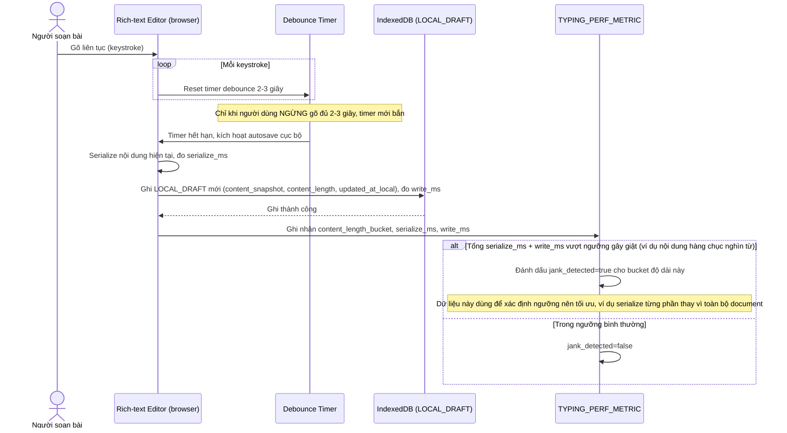

# Enhance sequence — Edit article (debounce autosave vào IndexedDB, đo ngưỡng gây giật)

Đây là **enhance**, cùng flow "edit-article" như ở base nhưng thay đổi hoàn toàn cơ chế autosave: thay vì gọi thẳng server định kỳ, mỗi lần ngừng gõ 2-3 giây mới serialize và ghi 1 bản draft vào IndexedDB (debounce), đồng thời đo thời gian serialize/ghi theo độ dài nội dung để xác định ngưỡng bắt đầu gây giật khi gõ. Đáp ứng yêu cầu 1 của đề bài.

