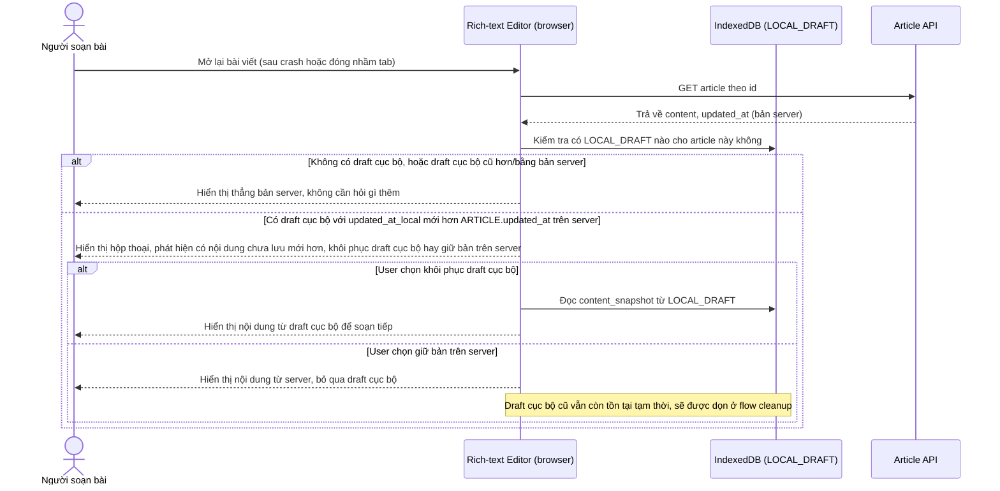

# Enhance sequence — Open article (phát hiện draft cục bộ mới hơn bản server)

Đây là **enhance**, cùng flow "open-article" như ở base nhưng thêm bước kiểm tra draft trong IndexedDB trước khi hiển thị. Nếu phát hiện có draft cục bộ mới hơn bản đã lưu trên server (dấu hiệu của crash hoặc đóng nhầm tab trước đó), hệ thống phải hỏi rõ người dùng chọn khôi phục draft cục bộ hay giữ bản trên server, không tự động ghi đè ngầm định. Đáp ứng yêu cầu 2 của đề bài.

