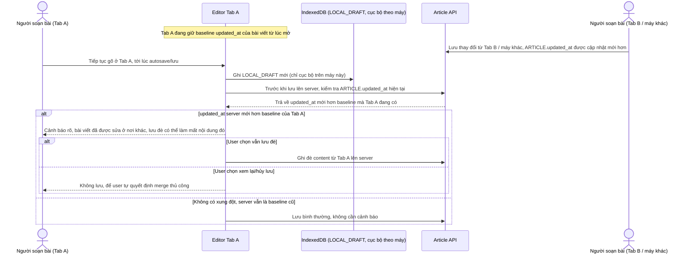

# Enhance sequence — Cảnh báo xung đột khi server đã có bản mới hơn từ tab/máy khác

Đây là **enhance**, flow hoàn toàn mới, xử lý tình huống mở cùng 1 bài viết ở 2 tab hoặc 2 máy khác nhau. Vì draft cục bộ trong IndexedDB chỉ có ý nghĩa cục bộ, không đồng bộ qua lại giữa các máy, nên trước khi lưu đè lên server hệ thống phải kiểm tra xem server đã bị sửa từ nơi khác mới hơn baseline mà tab hiện tại đang biết hay chưa, và cảnh báo rõ nguy cơ mất nội dung thay vì im lặng ghi đè. Đáp ứng yêu cầu 3 của đề bài.

