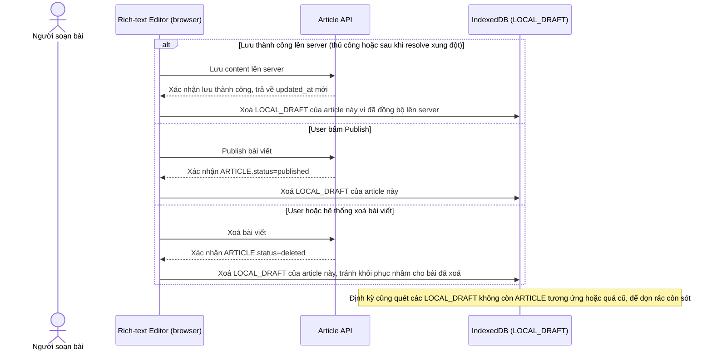

# Enhance sequence — Dọn dẹp draft cục bộ sau khi lưu server hoặc publish/xoá bài

Đây là **enhance**, flow hoàn toàn mới, đảm bảo draft trong IndexedDB không tồn đọng vô thời hạn. Ngay sau khi lưu thành công lên server, hoặc khi bài viết được publish/xoá, draft cục bộ tương ứng phải được xoá để tránh phình dung lượng IndexedDB và tránh vô tình khôi phục nhầm draft lỗi thời cho một bài đã bị xoá từ lâu. Đáp ứng yêu cầu 4 của đề bài.

