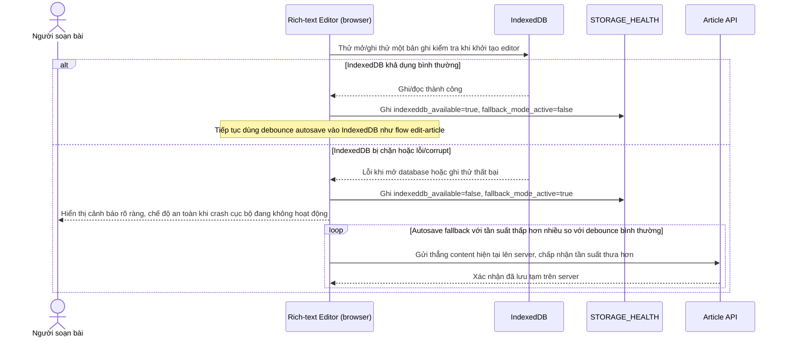

# Enhance sequence — Fallback khi IndexedDB lỗi/không khả dụng

Đây là **enhance**, flow hoàn toàn mới, xử lý trường hợp IndexedDB bị chặn (ví dụ chế độ ẩn danh của một số trình duyệt) hoặc storage bị corrupt. Hệ thống phải phát hiện tình trạng này, chuyển sang fallback autosave thẳng lên server với tần suất thấp hơn, và cảnh báo rõ cho người dùng biết chế độ "an toàn khi crash cục bộ" đang không hoạt động. Đáp ứng yêu cầu 5 của đề bài.

