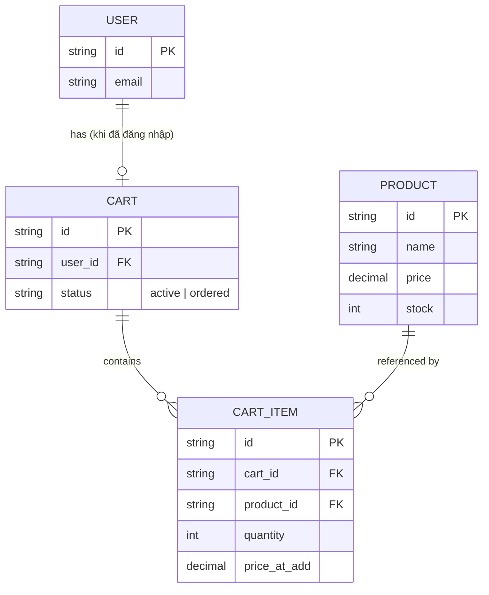

# Base ERD — Giỏ hàng và checkout trước khi có persistence bằng localStorage

Đây là **base**: mô hình dữ liệu suy luận từ ngữ cảnh đề bài, mô tả trạng thái hệ thống **trước khi** giỏ hàng/form checkout được lưu vào localStorage. Đề bài giả định đã có sản phẩm, giỏ hàng, và checkout hoạt động server-driven cho user đã đăng nhập; còn giỏ hàng của guest (chưa đăng nhập) chỉ tồn tại tạm trong bộ nhớ JS của trang, mất ngay khi reload/đóng tab. Chưa có bất kỳ entity nào phía client (localStorage cart, snapshot giá, đồng bộ đa tab, TTL draft) — toàn bộ phần đó là enhance.

