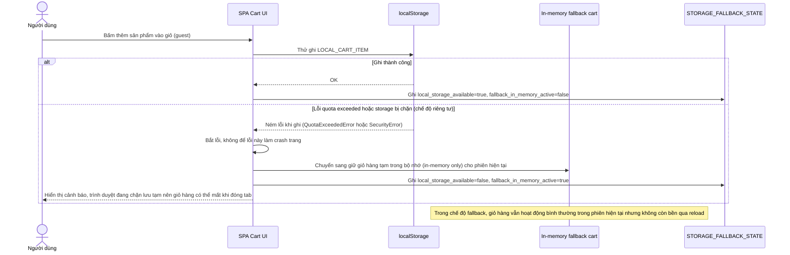

# Enhance sequence — Fallback khi localStorage đầy hoặc bị chặn

Đây là **enhance**, flow hoàn toàn mới, xử lý trường hợp localStorage bị đầy (quota exceeded) hoặc bị user tắt (chế độ duyệt riêng tư/chặn storage). Hệ thống phải phát hiện tình trạng này, chuyển sang fallback in-memory only, và cảnh báo user mà không làm crash trang. Đáp ứng yêu cầu 4 của đề bài.

