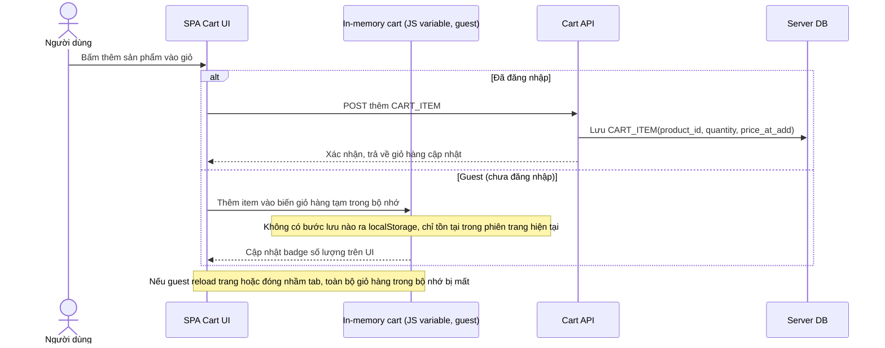

# Base sequence — Add to cart (guest cart chỉ tồn tại trong bộ nhớ, mất khi reload)

Đây là **base**, flow thêm sản phẩm vào giỏ ở trạng thái trước enhance. Với user đã đăng nhập, item được ghi thẳng lên giỏ hàng server. Với guest (chưa đăng nhập), giỏ hàng chỉ tồn tại trong biến JS ở bộ nhớ trang, không có bước lưu nào ra localStorage — nên reload hoặc đóng nhầm tab là mất toàn bộ giỏ. Đây chính là vấn đề mà enhance sẽ giải quyết bằng localStorage.

