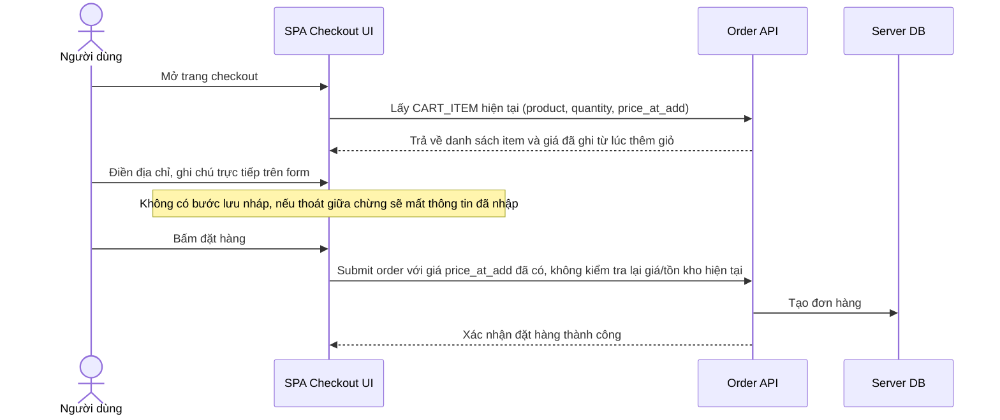

# Base sequence — Checkout (form nhập trực tiếp, không lưu nháp, giá lấy live)

Đây là **base**, flow checkout ở trạng thái trước enhance. Người dùng điền địa chỉ/ghi chú trực tiếp trên form, không có bước lưu nháp nào — nếu thoát giữa chừng thì mất hết thông tin đã nhập. Giá sản phẩm được lấy trực tiếp từ CART_ITEM đã ghi ở bước thêm giỏ hàng, dùng luôn để đặt hàng, không có bước revalidate lại. Flow này là nền để so sánh với flow cùng tên ở enhance, nơi thêm revalidate giá/tồn kho và cơ chế TTL cho form nháp.

