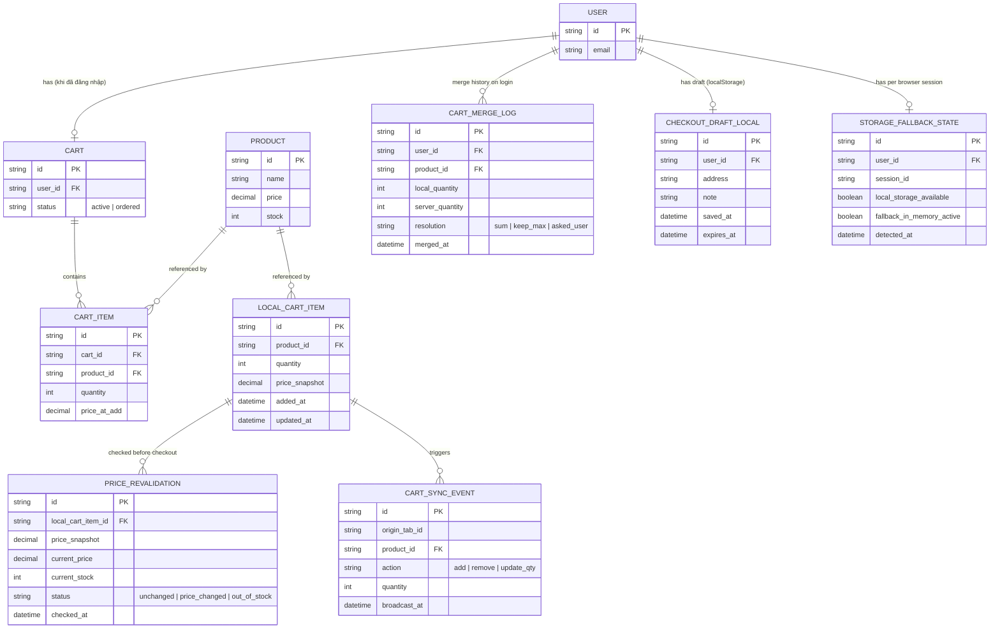

# Enhance ERD — Giỏ hàng và checkout draft qua localStorage

Đây là ERD **sau khi** enhance được áp dụng lên base. So với base (CART/CART_ITEM chỉ có ý nghĩa cho user đã đăng nhập, guest cart chỉ ở bộ nhớ), phần enhance thêm 5 nhóm entity mới ở phía client, ứng trực tiếp với các yêu cầu trong đề bài:

- `LOCAL_CART_ITEM` (mới, localStorage) — giỏ hàng guest được lưu bền thay vì chỉ ở bộ nhớ, kèm `price_snapshot` tại thời điểm thêm — nền cho yêu cầu 1 và 2.
- `CART_MERGE_LOG` (mới) — ghi lại quyết định merge giữa giỏ local và giỏ server khi đăng nhập (cộng dồn, giữ số lượng lớn hơn, hoặc hỏi user) — yêu cầu 1.
- `PRICE_REVALIDATION` (mới) — kết quả so sánh `price_snapshot` cục bộ với giá/tồn kho thật tại thời điểm checkout — yêu cầu 2.
- `CART_SYNC_EVENT` (mới) — sự kiện phát qua `storage`/BroadcastChannel khi 1 tab add/remove item, để tab khác cập nhật badge mà không ghi đè thay đổi của nhau — yêu cầu 3.
- `STORAGE_FALLBACK_STATE` (mới) — trạng thái localStorage có khả dụng không (quota exceeded hoặc bị chặn), có đang fallback in-memory không — yêu cầu 4.
- `CHECKOUT_DRAFT_LOCAL` (mới, localStorage) — form checkout dở dang (địa chỉ, note) kèm `expires_at` để tự hết hạn — yêu cầu 5.

