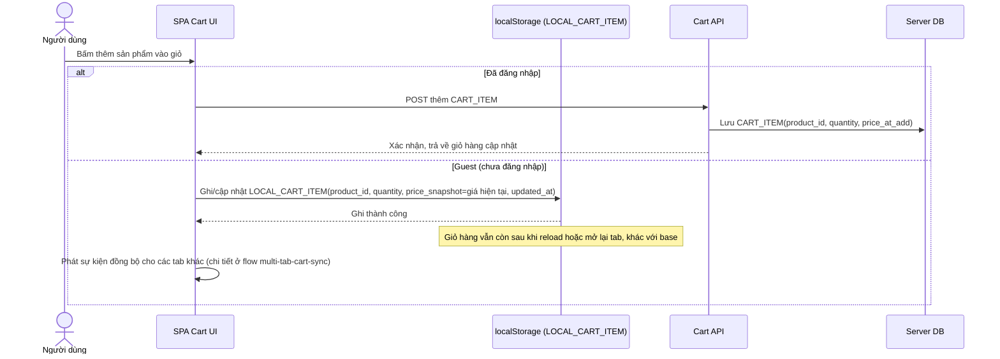

# Enhance sequence — Add to cart (guest cart bền vững qua localStorage)

Đây là **enhance**, cùng flow "add-to-cart" như ở base nhưng thay đổi ở phần guest: thay vì chỉ giữ trong biến bộ nhớ JS (mất khi reload), item được ghi vào localStorage kèm `price_snapshot` tại thời điểm thêm. Đây là nền cho yêu cầu 1 (merge khi đăng nhập) và yêu cầu 2 (snapshot giá để revalidate khi checkout); việc phát sự kiện đồng bộ đa tab được nói rõ hơn ở flow multi-tab-cart-sync riêng.

