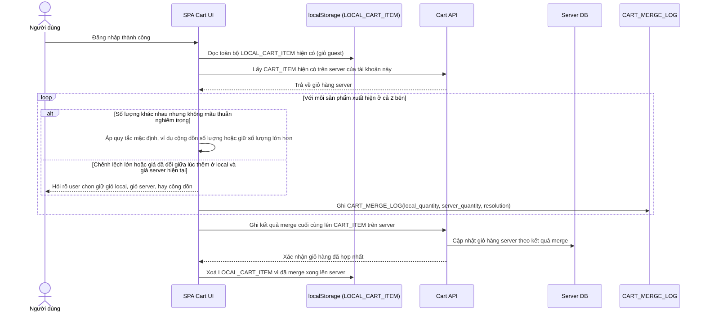

# Enhance sequence — Merge giỏ hàng local với giỏ hàng server khi đăng nhập

Đây là **enhance**, flow hoàn toàn mới, phát sinh từ enhance. Khi user đăng nhập, giỏ hàng guest trong localStorage phải được merge đúng với giỏ hàng đã có sẵn trên server của tài khoản đó, theo quy tắc ưu tiên rõ ràng, không ghi đè ngầm định gây mất dữ liệu. Đáp ứng yêu cầu 1 của đề bài.

