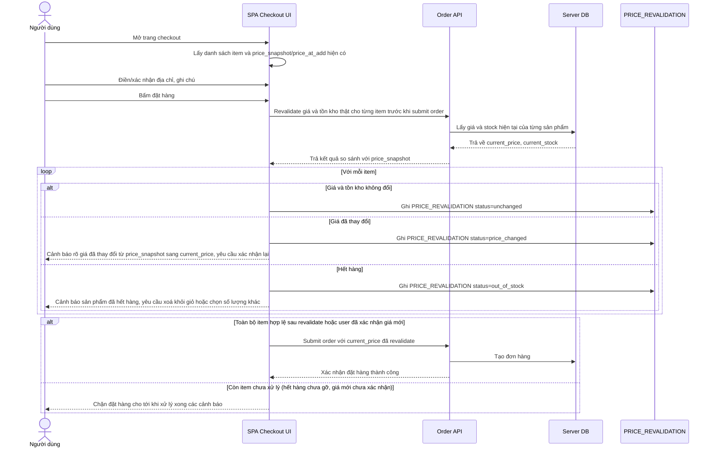

# Enhance sequence — Checkout (revalidate giá/tồn kho trước khi thanh toán)

Đây là **enhance**, cùng flow "checkout" như ở base nhưng thêm bước revalidate: vì giá dùng ở giỏ hàng có thể là `price_snapshot`/`price_at_add` đã cũ (đặc biệt với guest cart lưu lâu trong localStorage), trước khi xác nhận thanh toán hệ thống phải kiểm tra lại giá/tồn kho thật với server và xử lý rõ khi giá đổi hoặc hết hàng, không để user thanh toán nhầm giá cũ. Đáp ứng yêu cầu 2 của đề bài.

