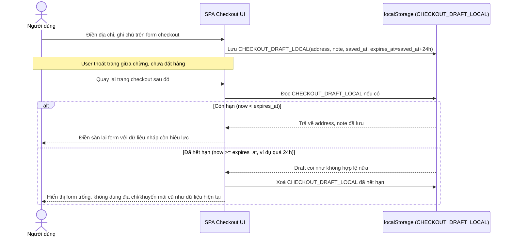

# Enhance sequence — Checkout draft tự hết hạn theo TTL

Đây là **enhance**, flow hoàn toàn mới, xử lý form checkout dở dang (địa chỉ, ghi chú) lưu trong localStorage. Vì thông tin này có thể lỗi thời (địa chỉ cũ, khuyến mãi hết hạn) nếu để lâu, mỗi bản nháp phải có TTL (ví dụ 24h) và tự động không được coi là dữ liệu hiện tại khi đã hết hạn. Đáp ứng yêu cầu 5 của đề bài.

