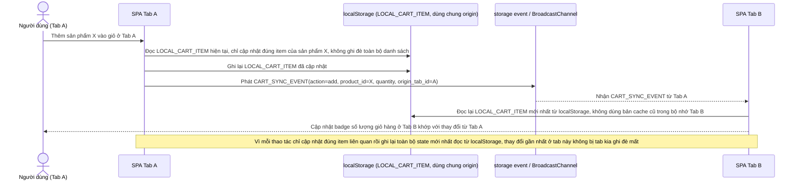

# Enhance sequence — Đồng bộ giỏ hàng giữa nhiều tab

Đây là **enhance**, flow hoàn toàn mới, xử lý trường hợp mở nhiều tab cùng giỏ hàng guest. Khi 1 tab thêm/xoá item, các tab khác phải cập nhật badge số lượng qua `storage` event hoặc BroadcastChannel, đồng thời tránh tình trạng 1 tab ghi đè toàn bộ localStorage của tab khác làm mất thay đổi vừa thực hiện ở tab kia. Đáp ứng yêu cầu 3 của đề bài.

