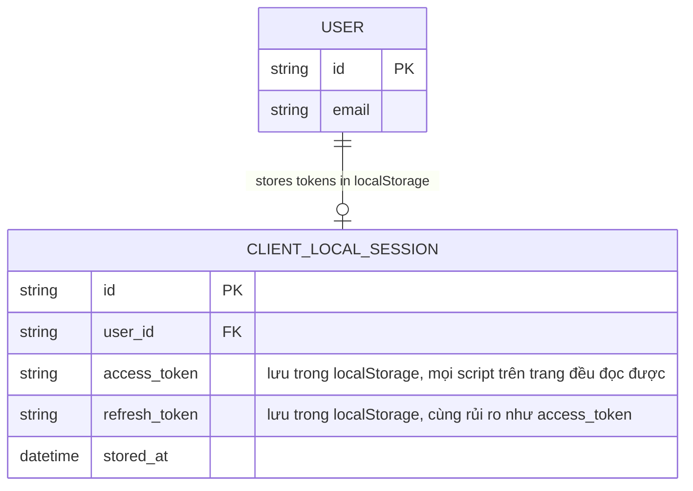

# Base ERD — Lưu token phía client trước khi siết bảo mật

Đây là **base**: mô hình dữ liệu suy luận từ ngữ cảnh đề bài, mô tả trạng thái hệ thống **trước khi** áp các yêu cầu bảo mật nghiêm ngặt. Đề bài ngầm định hệ thống ngân hàng số hiện đã có đăng nhập và lưu token phía client theo cách đơn giản/naive: cả access token lẫn refresh token đều được lưu chung vào localStorage sau khi đăng nhập, không phân loại theo mức độ nhạy cảm, không có idle timeout, không có đồng bộ đăng xuất giữa các tab, chưa xử lý bfcache. Đây chính là những vấn đề mà enhance sẽ giải quyết.

