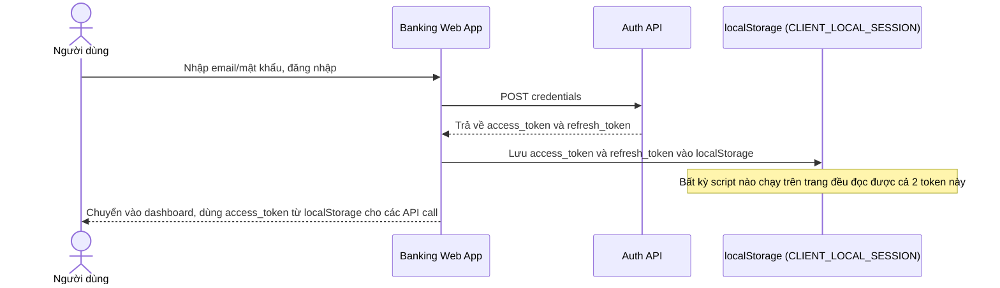

# Base sequence — Login (cả 2 token đều lưu localStorage)

Đây là **base**, flow đăng nhập ở trạng thái trước enhance. Sau khi xác thực, server trả về cả access token lẫn refresh token, và client lưu cả 2 vào localStorage để dùng cho các lần gọi API sau. Đây chính là điểm mà enhance sẽ thay đổi triệt để: bất kỳ đoạn script nào chạy trên trang, kể cả script bên thứ ba lỡ bị compromise, cũng đọc được các token này.

