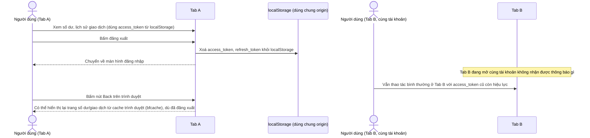

# Base sequence — Logout (chỉ xoá tab hiện tại, không có audit cache)

Đây là **base**, flow đăng xuất ở trạng thái trước enhance. Logout chỉ xoá localStorage của đúng tab đang bấm, các tab khác đang mở với cùng tài khoản vẫn còn access_token hợp lệ trong localStorage của chúng (localStorage dùng chung theo origin nhưng flow logout ở base không chủ động thông báo cho tab khác). Ngoài ra không có xử lý gì cho cache-control hay bfcache, nên bấm Back sau khi logout có thể thấy lại trang có dữ liệu nhạy cảm từ bộ nhớ cache trình duyệt.

