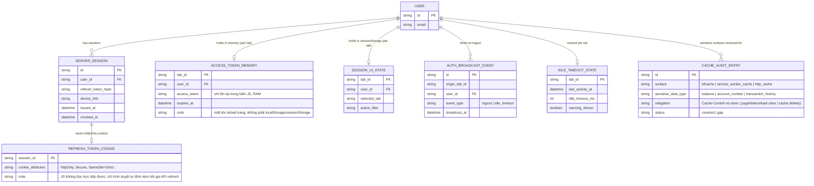

# Enhance ERD — Phân loại nơi lưu theo mức độ nhạy cảm

Đây là ERD **sau khi** enhance được áp dụng lên base. So với base (mọi thứ dồn vào `CLIENT_LOCAL_SESSION` trong localStorage), enhance tách dữ liệu ra nhiều nơi lưu khác nhau theo đúng mức độ nhạy cảm, và thêm cơ chế điều phối vòng đời. Một số entity dưới đây **không phải bảng DB thật** mà là cấu trúc sống trong bộ nhớ trình duyệt/cookie — được mô hình hoá dạng ERD để thấy rõ dữ liệu nào nằm ở đâu:

- `ACCESS_TOKEN_MEMORY` (mới, chỉ tồn tại trong biến JS ở RAM) — không phải localStorage/sessionStorage, mất khi reload trang, giảm bề mặt tấn công XSS vì script không tồn tại nào đọc được sau khi trang tải lại — yêu cầu 1.
- `REFRESH_TOKEN_COOKIE` (mới, cookie httpOnly + Secure + SameSite do server set) — JS không đọc trực tiếp được, khác hẳn base lưu refresh_token vào localStorage mà mọi script kể cả script bên thứ ba compromised đều đọc được — yêu cầu 1.
- `SERVER_SESSION` (mới, bảng thật trên server) — cho phép server thu hồi refresh token tập trung, làm nền cho việc đăng xuất có hiệu lực ở mọi tab/thiết bị — yêu cầu 2.
- `SESSION_UI_STATE` (mới, sessionStorage, cô lập theo tab) — dữ liệu phi nhạy cảm như tab đang chọn, filter dashboard — yêu cầu 2, 4.
- `AUTH_BROADCAST_EVENT` (mới, kênh BroadcastChannel riêng cho auth, đặt tên tách biệt khỏi kênh của tính năng khác) — phát sự kiện logout tới mọi tab cùng origin — yêu cầu 2, 4.
- `IDLE_TIMEOUT_STATE` (mới, bộ nhớ JS theo tab) — theo dõi thời gian không thao tác để tự động đăng xuất trên máy dùng chung — yêu cầu 3.
- `CACHE_AUDIT_ENTRY` (mới, bảng ghi nhận nội bộ dùng cho audit bảo mật) — liệt kê nơi dữ liệu nhạy cảm có thể vô tình bị cache lại (bfcache, service worker cache) và biện pháp chặn — yêu cầu 5.

