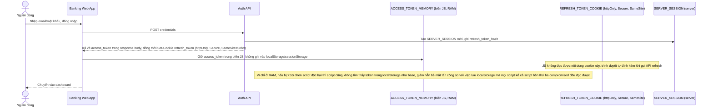

# Enhance sequence — Login (access token chỉ ở memory, refresh token là cookie httpOnly)

Đây là **enhance**, cùng flow "login" như ở base nhưng thay đổi triệt để nơi lưu 2 loại token. Access token ngắn hạn chỉ giữ trong biến JS ở bộ nhớ (không phải localStorage/sessionStorage) để giảm bề mặt tấn công XSS. Refresh token không còn do JS lưu, mà server set thẳng vào cookie httpOnly + Secure + SameSite, JS không đọc trực tiếp được. Đáp ứng yêu cầu 1 của đề bài.

